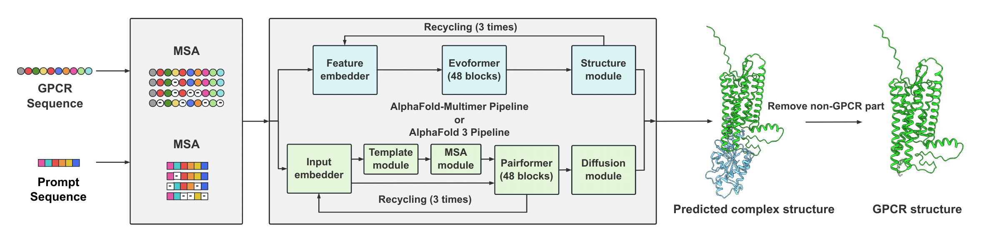

# PromptGPCR

**Multi-state Structure Prediction of G Protein-Coupled Receptor Proteins via Prompting on AlphaFold**

PromptGPCR uses biological sequence prompts to guide **AlphaFold-Multimer** and **AlphaFold 3** toward active- and inactive-state GPCR structures. A receptor and a selected prompt are modeled as separate protein chains. The receptor chain is then extracted from the predicted complex for analysis.

This is an inference-stage framework using pretrained AlphaFold models. The prompts are amino acid sequences; running PromptGPCR does not require training a new model.

[Paper](https://spj.science.org/doi/full/10.34133/csbj.0179) · [Published supplement](https://spj.science.org/doi/suppl/10.34133/csbj.0179/suppl_file/csbj.0179.f1.pdf) · [Issues](https://github.com/PAFFMew/PromptGPCR/issues)

Published in *Computational and Structural Biotechnology Journal*, **35**(1), Article 0179, 2026. DOI: [10.34133/csbj.0179](https://doi.org/10.34133/csbj.0179).

## Contents

- [Overview](#overview)
- [Repository contents](#repository-contents)
- [Setup and software versions](#setup-and-software-versions)
- [Basic protocol](#basic-protocol)
- [Datasets and evaluation](#datasets-and-evaluation)
- [Citation](#citation)
- [License and support](#license-and-support)

## Overview

[](figures/Fig1.pdf)

PromptGPCR supplies a state-associated protein sequence alongside a target GPCR. Both chains are processed by a complex structure predictor using sequence and multiple sequence alignment (MSA) information, **without structural templates**.

| Prediction task | Prompt | Input to the predictor |
| --- | --- | --- |
| Active-state modeling | mini-Gs | GPCR chain + mini-Gs chain |
| Inactive-state modeling | T4 lysozyme | GPCR chain + T4 lysozyme chain |
| Inactive-state negative control | Dihydrofolate reductase, UniProt P0ABQ4 | GPCR chain + control chain |

The prompt is an **independent chain**, including for T4 lysozyme. The published inference protocol does not insert the prompt into the GPCR sequence or replace its intracellular loop.

See the paper's **Materials and Methods** for the biological rationale and modeling procedure.

## Repository contents

The following tree shows the intended repository layout, including resources that are awaiting upload. The two benchmark directories correspond, in order, to the paper's benchmark dataset and unseen dataset. File patterns indicate the expected formats; the final benchmark filenames are not prescribed here.

```text
PromptGPCR/
├── README.md
├── LICENSE
├── data/
│   ├── prompt_sequences/
│   │   ├── miniGs.fasta
│   │   ├── T4.fasta
│   │   └── comparison/
│   │       └── P0ABQ4.fasta
│   ├── GPCR_benchmark_1/
│   │   ├── *.fasta
│   │   └── *.xlsx
│   ├── GPCR_benchmark_2/
│   │   ├── *.fasta
│   │   └── *.xlsx
│   └── docking_set/
└── figures/
```

| Resource | Description |
| --- | --- |
| `data/prompt_sequences/` | Protein sequence prompts: `miniGs.fasta` for active-state modeling, `T4.fasta` for inactive-state modeling, and `comparison/` for control sequences. The comparison group includes *E. coli* dihydrofolate reductase (`P0ABQ4.fasta`), the inactive-state negative control. |
| `data/GPCR_benchmark_1/` | Inputs for the paper's main benchmark: **107 class A GPCRs with 411 experimental reference structures**. Contains one input FASTA per receptor and an Excel mapping from receptor names to available active- and inactive-state ground-truth (GT) structures. |
| `data/GPCR_benchmark_2/` | Inputs for the paper's unseen benchmark: **20 GPCRs with 44 active-state experimental reference structures**. Contains one input FASTA per receptor and an Excel mapping from receptor names to active-state GT structures. |
| `data/docking_set/` | Docking results for the nine GPCR–ligand targets evaluated in the paper. |
| `figures/` | Figure assets used in the main text of the paper. |

The benchmark directories are organized around receptor input sequences and GT annotations; the structure counts above refer to experimental references, not the number of FASTA inputs. Receptors in the first benchmark may have one or both annotated states.

**Upload status:** the benchmark inputs, main prompt sequences, and docking results are pending. In the current checkout, the control sequence remains at [data/prompt_sequences/P0ABQ4.fasta](data/prompt_sequences/P0ABQ4.fasta), and figure assets are available in [figures/](figures/). The tree shows the intended organization of the control sequence under `comparison/`.

## Setup and software versions

### Obtain the repository

```bash
git clone https://github.com/PAFFMew/PromptGPCR.git
cd PromptGPCR
```

Install the selected prediction backend separately, following its upstream documentation. Local AlphaFold inference requires a compatible Linux/GPU environment, model parameters, and the sequence databases required by that backend. Consult the version-specific installation instructions for hardware and storage requirements.

### Prediction backends and baselines

The paper evaluates four unprompted baselines: AlphaFold 2, AlphaFold-MultiState, AlphaFold-Multimer, and AlphaFold 3. PromptGPCR adds sequence prompts to the latter two complex predictors.

The table records **versions reported in the PromptGPCR publication**, rather than substituting current upstream releases for the versions used in the experiments.

| Method | Official code repository | Version reported for the study | Role and configuration |
| --- | --- | --- | --- |
| AlphaFold 2 | [google-deepmind/alphafold](https://github.com/google-deepmind/alphafold) | Exact release/commit not reported. | Single-chain GPCR baseline; the monomer preset and parameter archive need to be recorded for exact reproduction. |
| AlphaFold-MultiState | [huhlim/alphafold-multistate](https://github.com/huhlim/alphafold-multistate) | Exact release/commit not reported. | State-specific, template-based baseline. Its published study protocol uses activation-state-annotated GPCR templates and omits MSA information. |
| AlphaFold-Multimer | [google-deepmind/alphafold](https://github.com/google-deepmind/alphafold/tree/v2.2.3) | **v2.2.3** is explicitly stated for the PromptGPCR backbone; a separate baseline version is not specified. | Complex-prediction backend for PromptGPCR, also evaluated without a prompt. Select the prediction with the highest confidence score. |
| AlphaFold 3 | [google-deepmind/alphafold3](https://github.com/google-deepmind/alphafold3) | Exact code release/commit and parameter version not reported. | Complex-prediction backend and unprompted baseline. The paper reports 5 seeds × 5 structures per seed and selection by the highest ranking score. |

The upstream AlphaFold **v2.2.3** tag resolves to commit [`86a0b8ec7a39698a7c2974420c4696ea4cb5743a`](https://github.com/google-deepmind/alphafold/commit/86a0b8ec7a39698a7c2974420c4696ea4cb5743a). A source-code tag alone does not specify the downloaded weights, database snapshots, or PromptGPCR-specific template handling.

For AlphaFold-MultiState setup and state selection, follow its [official instructions](https://github.com/huhlim/alphafold-multistate#gpcr-structure-prediction-using-alphafold). Its `study` preset supports `--state active` and `--state inactive`. Record the state-annotated template database used in any reproduced baseline run.

### Docking software

The downstream evaluation uses **CSAlign-Dock**, available through the [official GalaxyWEB service](https://galaxy.seoklab.org/csalign). The PromptGPCR paper does not specify a software release or service build. The CSAlign-Dock authors provide the service link in their [method paper](https://doi.org/10.1016/j.csbj.2022.11.047); a versioned GitHub implementation is not identified there.

## Basic protocol

### 1. Prepare the target receptor

Obtain the target GPCR's wild-type amino acid sequence from UniProt and save it as a FASTA record. Record the accession and sequence version. The study collected receptor sequences in July 2023.

For evaluation against an experimental structure, keep an alignment between the wild-type sequence and the experimental receptor chain. This mapping is needed to exclude unresolved residues, fusion partners, and other non-GPCR regions from comparisons.

### 2. Choose the state and prompt

Use **mini-Gs** for an active-state prediction and **T4 lysozyme** for an inactive-state prediction. Run the two states as separate jobs. The study selected the full mini-Gs prompt after comparing mini-Gs, mini-Gi, mini-Gq, and truncated prompts.

**The exact mini-Gs and T4 lysozyme FASTA sequences used in the study are pending upload as `miniGs.fasta` and `T4.fasta` in `data/prompt_sequences/` and are not listed in the published supplementary PDF.** Obtain those experimental input sequences before attempting an exact reproduction. Engineered mini-G constructs and wild-type G proteins are not interchangeable inputs.

Use [P0ABQ4.fasta](data/prompt_sequences/P0ABQ4.fasta) only when reproducing the reported negative-control experiment.

### 3. Construct the multichain input

| Backend | Input preparation |
| --- | --- |
| AlphaFold-Multimer | Supply one multirecord FASTA containing the receptor and one prompt as separate records. Use the multimer model configuration. |
| AlphaFold 3 | Supply two protein entities in the input JSON, one for the receptor and one for the prompt, with distinct chain identifiers. |

Keep a record of the receptor chain identifier so that it can be recovered from the predicted complex. Do not concatenate the receptor and prompt into a single continuous sequence.

### 4. Generate MSAs and exclude structural templates

The study follows the AlphaFold-Multimer data pipeline for MSA searches. Retain the MSA inputs, search settings, and database versions for reproduction. PromptGPCR uses sequence/MSA information while excluding structural templates from prediction.

- **AlphaFold-Multimer:** ensure that the actual feature/model pipeline excludes structural template information. A template date cutoff alone does not establish a template-free run. The corresponding PromptGPCR configuration or patch remains to be released.
- **AlphaFold 3:** in the official local input format, set `"templates": []` for each protein entity while retaining or generating its MSA. An omitted or `null` template field can invoke template search. Follow the [upstream input specification](https://github.com/google-deepmind/alphafold3/blob/main/docs/input.md) for the installed version.

The AlphaFold 3 input guidance above explains the upstream interface; it does not establish which exact software revision or MSA settings were used for the paper.

### 5. Predict and select a complex

| Backend | Sampling and selection reported in the paper |
| --- | --- |
| AlphaFold-Multimer | Retain the prediction with the highest confidence score for each target. The exact seed list, sampling count, and recycle settings are not reported. |
| AlphaFold 3 | Use **5 random seeds**, generate **5 structures per seed** (**25 structures per target**), and retain the structure with the highest ranking score. The numerical seed values are not reported. |

Apply the same selection rule consistently across targets and states. Experimental RMSD is an evaluation metric, not the criterion used to choose the predicted model.

### 6. Extract and evaluate the receptor

Extract the GPCR chain from the selected complex. Keep the full complex and its confidence/ranking files for traceability. Align the receptor to the experimental reference through the sequence mapping prepared in step 1.

For a new run, retain the input sequences, MSAs, backend version, weight identifiers, template settings, random seeds, and sampling configuration alongside the output structures. These records help distinguish a reproduction from a run using updated resources.

## Datasets and evaluation

### Structure-prediction datasets

Dataset sizes and collection windows below are taken from the paper's **Data processing** section.

| Dataset | Repository directory | Size | Selection criteria |
| --- | --- | --- | --- |
| Benchmark | `data/GPCR_benchmark_1/` | **411 structures from 107 class A receptors** | Structures released before July 28, 2022; resolution ≤ 3.5 Å; intermediate states excluded. Of the receptors, 33 have both states, 36 only inactive states, and 38 only active states. |
| Unseen set | `data/GPCR_benchmark_2/` | **44 active-state structures from 20 receptors** | Structures collected from July 28, 2022 to March 29, 2023; receptors already in the benchmark excluded; inactive-state entries removed. |
| Docking set | `data/docking_set/` | **9 active-state GPCR–ligand structures** | Small-molecule-bound entries selected from the unseen set. |

The benchmark can overlap with AlphaFold training data. The label “unseen” refers to the study's dataset construction and evaluated models; reassess overlap when using newer model weights.

Use **GDT-TS** to assess receptor backbone prediction and **RMSD** to assess the ligand-binding pocket. The paper reports all-atom, backbone-atom, and Cα pocket RMSDs. Restrict comparisons to matched GPCR residues and document the atom selection and alignment procedure.

### Docking test set

The `data/docking_set/` directory is designated for docking results for the following nine targets, listed in **Table A4** of the [published supplement](https://spj.science.org/doi/suppl/10.34133/csbj.0179/suppl_file/csbj.0179.f1.pdf).

| Receptor label in Table A4 | PDB ID | Receptor chain | Resolution (Å) |
| --- | --- | --- | --- |
| GPR119 | 7WCM | R | 2.3 |
| HCA2 | 7XK2 | R | 3.1 |
| SST4 | 7XMT | R | 2.8 |
| TSH | 7XW6 | R | 2.8 |
| RXFP4 | 7YK7 | R | 2.8 |
| MRGPRX1 | 8DWG | R | 2.7 |
| 51E2 | 8F76 | A | 3.1 |
| FFA4 | 8G59 | R | 2.6 |
| GPR35 | 8H8J | C | 3.2 |

### Docking protocol

1. Globally align the predicted receptor and its experimental reference into the same coordinate system.
2. Transfer the reference ligand pose from the experimental complex to the aligned predicted receptor, as required by CSAlign-Dock. Apply this preparation consistently to PromptGPCR and all baselines.
3. Run CSAlign-Dock with the ligand and prepared receptor/reference-ligand complex.
4. Inspect the **top five ligand poses ranked by energy** and calculate their RMSDs against the experimental ligand pose.
5. Count a target as successful if **at least one of the five poses has ligand RMSD < 2 Å**. For the per-target RMSD summary, use the minimum RMSD among these five poses.

This evaluation measures **reference-guided pose recovery**. The reported docking success rate does not establish performance in blind docking or prospective virtual screening.

## Citation

```bibtex
@article{sun2026promptgpcr,
  title   = {Multi-state Structure Prediction of {G} Protein-Coupled Receptor Proteins via Prompting on {AlphaFold}},
  author  = {Sun, Zhigang and Zhang, Tao and Zhang, Kexin and Pang, Anqi and Yu, Jiale and Zeng, Liting and Yang, Sibei and Zhao, Suwen and Zheng, Jie},
  journal = {Computational and Structural Biotechnology Journal},
  year    = {2026},
  volume  = {35},
  number  = {1},
  pages   = {0179},
  doi     = {10.34133/csbj.0179},
  url     = {https://spj.science.org/doi/full/10.34133/csbj.0179}
}
```

## License and support

See [LICENSE](LICENSE) for the repository's MIT license. External software, model parameters, databases, and publisher-hosted materials remain subject to their respective licenses and terms.

For questions, corrections, or contributions, open a [GitHub issue](https://github.com/PAFFMew/PromptGPCR/issues). For reproducibility questions, include the backend version, input preparation, relevant settings, and the step where the problem occurs.
